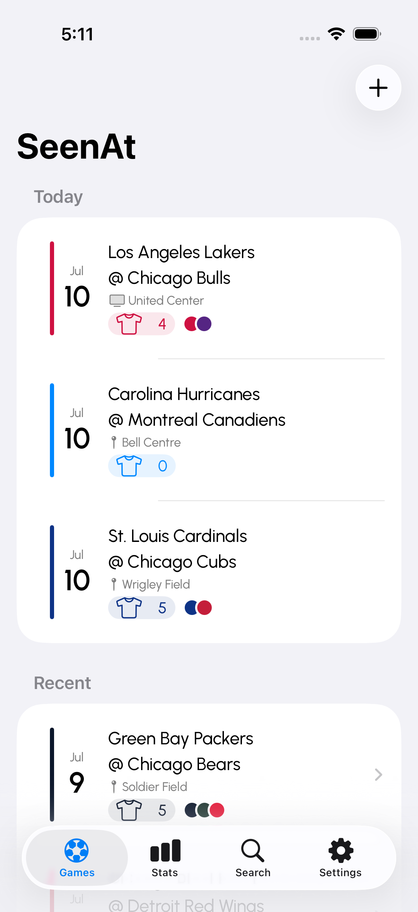
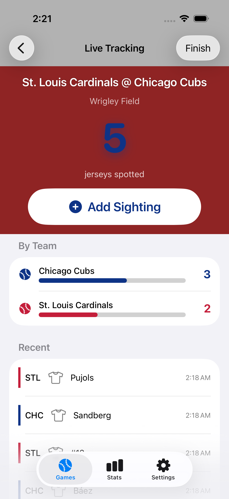
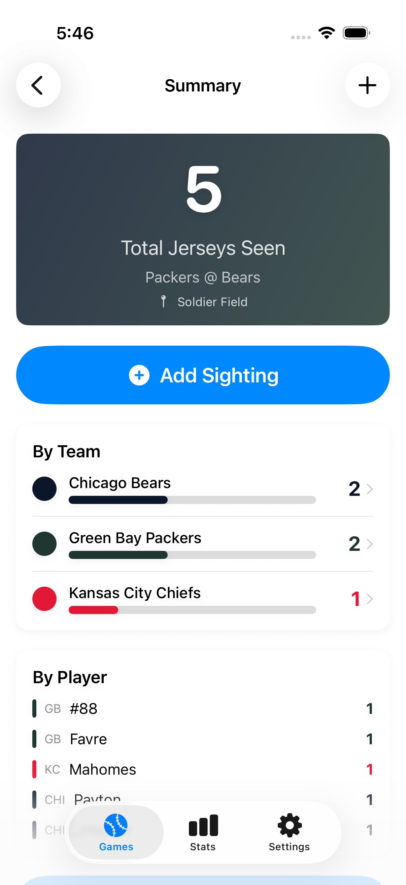
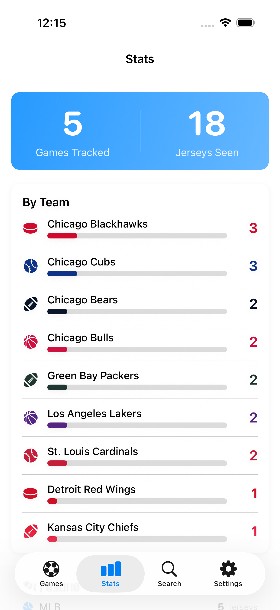
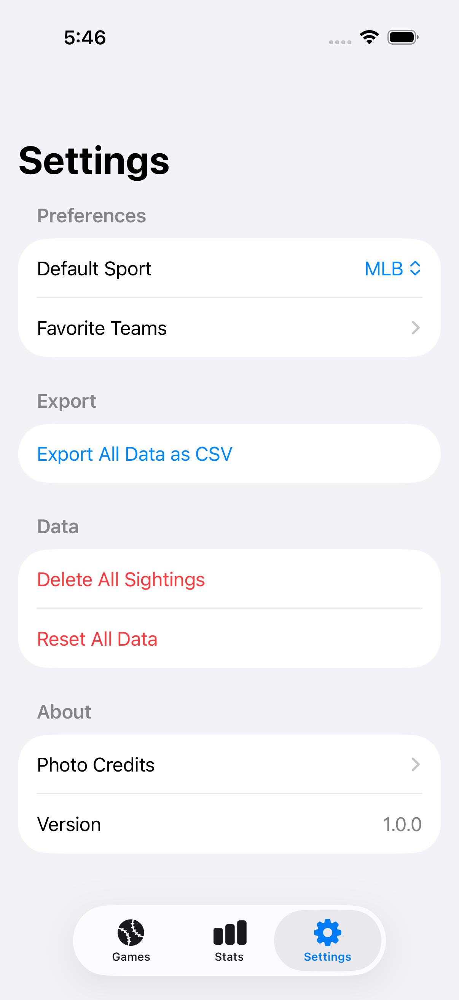
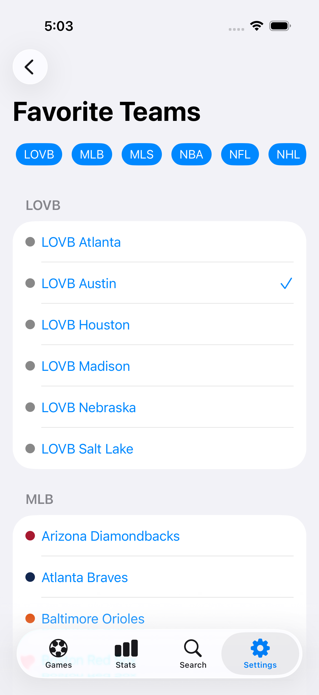

# SeenAt

Track every jersey you've Seen At the game.

SeenAt lets you log jerseys you spot at live sporting events, track which teams and players you see most, and relive your game-day memories through photos and stats.

## Features

- Create events for MLB, NBA, NFL, NHL, LOVB, and MLS games
- Log jersey sightings with team, player name, number, and photo
- Live Activities (Dynamic Island + Lock Screen) for in-game tracking
- Choose between **At Stadium** or **On TV** watch location
- Upcoming events list for future games
- Stats dashboard by team, league, and top players
- Photo gallery with player captions
- **Search** games by team or player name
- Deep linking via `seenat://` URL scheme
- 158 built-in teams across 6 leagues
- CSV data export

## Supported Leagues

| League | Data Source | Teams |
|--------|-------------|-------|
| MLB | [statsapi.mlb.com](https://statsapi.mlb.com) | 30 |
| NBA | [ESPN API](https://site.api.espn.com) | 30 |
| NFL | [ESPN API](https://site.api.espn.com) | 32 |
| NHL | [api-web.nhle.com](https://api-web.nhle.com) | 32 |
| LOVB | Manual entry | 6 |
| MLS | Manual entry | 28 |

## Screenshots

<div align="center">
  
  
  
</div>

<div align="center">
  
  
  
</div>

## Requirements

- iOS 17.0+
- Xcode 16+
- Swift 6.0

## Setup

This project uses [XcodeGen](https://github.com/yonaskolb/XcodeGen) to generate the `.xcodeproj` from `project.yml`.

```bash
brew install xcodegen
cd SeenAt
xcodegen generate
open SeenAt.xcodeproj
```

Build and run from Xcode on a simulator or device.

## Architecture

- **SwiftData** for local persistence (Team, Event, JerseySighting)
- **SwiftUI** for all views
- **ActivityKit** for Live Activities (widget extension)
- **XcodeGen** for project generation
- URL scheme `seenat://live-tracking/{eventUUID}` for deep linking

## Project Structure

```
SeenAt/
  Models/        — Event, Team, JerseySighting, LeagueGame, SchemaMigration, SeenAtActivityAttributes
  Services/      — API services, LiveActivityManager, TeamSeedService, ExportService, VenueImageService, ...
    TeamSeeds/   — Team seed data per league (MLB, NBA, NFL, NHL, LOVB, MLS)
  Resources/
    VenueImages/ — Venue photos (see Venue Images section below)
  Views/         — HomeView, LiveTrackingView, EventSummaryView, StatsView, SettingsView, SearchView, ...
  Extensions/    — Color+Hex, Color+Luminance
SeenAtWidget/    — Live Activity widget (Dynamic Island + Lock Screen)
SeenAtTests/     — Unit tests
SeenAtUITests/   — UI tests (screenshot capture)
```

## Venue Images

To add stadium/arena photos for display in event views:

1. Drop a PNG into `SeenAt/Resources/VenueImages/`
2. Name it after the venue's key in `VenueDirectory`, lowercased with punctuation removed and spaces replaced by hyphens

Examples:

| Venue Key | Filename |
|-----------|----------|
| `Wrigley Field` | `wrigley-field.png` |
| `GEHA Field at Arrowhead Stadium` | `geha-field-at-arrowhead-stadium.png` |
| `T-Mobile Park` | `t-mobile-park.png` |
| `Dignity Health Sports Park` | `dignity-health-sports-park.png` |
| `CITYPARK` | `citypark.png` |

Run `xcodegen generate` after adding new images so they're included in the Xcode project.

**Unique naming**: `VenueDirectory` keys are unique by definition — each venue has one key. If two stadiums share a name (e.g., "Toyota Stadium" for FC Dallas and a future tenant), they have distinct directory keys, and therefore distinct image filenames.

`VenueImageService.image(for:)` attempts to load from the `VenueImages/` bundle subdirectory using the normalized key.

## API Sources

| League | URL | Auth |
|--------|-----|------|
| MLB | `statsapi.mlb.com/api/v1/schedule` | None |
| NBA | `site.api.espn.com/apis/site/v2/sports/basketball/nba/scoreboard` | None |
| NFL | `site.api.espn.com/apis/site/v2/sports/football/nfl/scoreboard` | None |
| NHL | `api-web.nhle.com/v1/schedule/YYYY-MM-DD` | None |
| LOVB | Manual entry only | — |
| MLS | Manual entry only | — |

## License

This project is licensed under the [Mozilla Public License 2.0](https://www.mozilla.org/en-US/MPL/2.0/).
